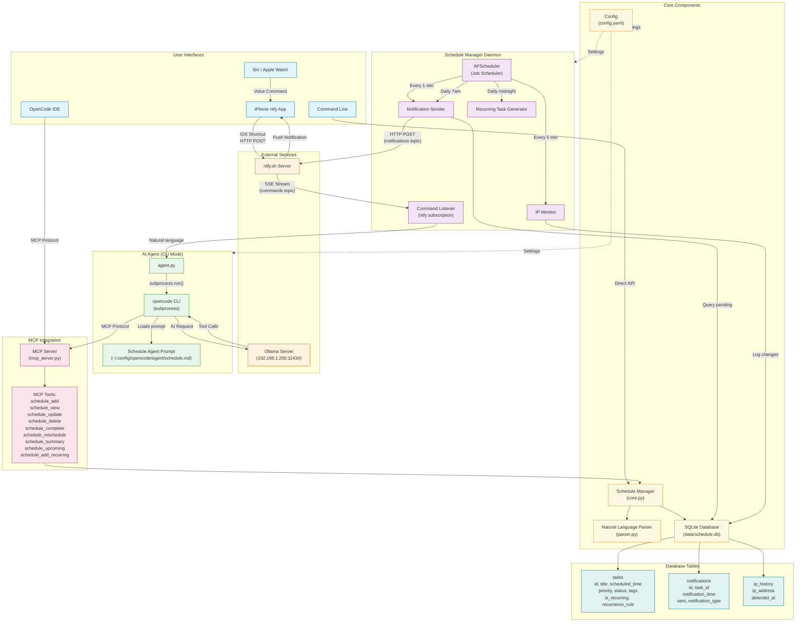
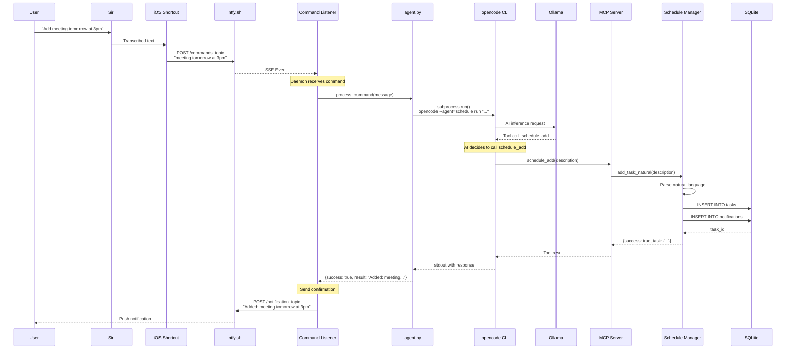
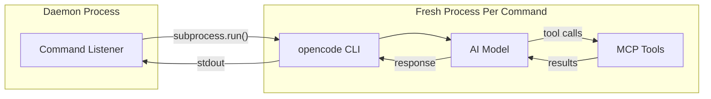
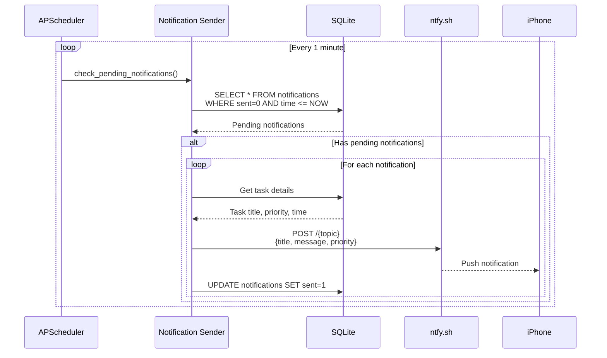
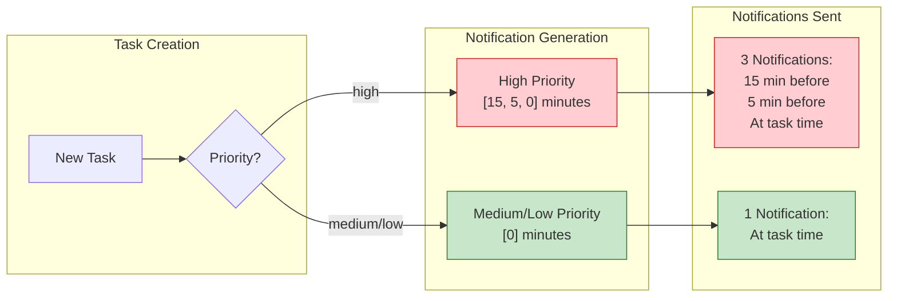
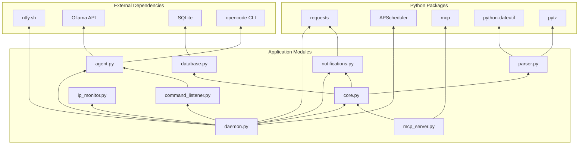

# Schedule Manager Architecture

## System Overview



## Voice Command Flow (Detailed)



## CLI Mode Architecture

The AI agent uses **CLI mode** - each command spawns a fresh `opencode` process:



**Command format:**
```bash
opencode --agent=schedule --model=ollama/gpt-oss:120b-128k run "user's natural language"
```

**Benefits:**
- No persistent server to manage
- Fresh state for each command (no context pollution)
- Process isolation (crashes don't affect daemon)
- Simpler code (~130 lines vs ~450)

## Notification Delivery Flow



## Priority-Based Notification System



## Component Dependencies



## File Structure

```
schedule-manager/
├── config.yaml                 # Main configuration
├── data/
│   └── schedule.db            # SQLite database
├── schedule_manager/
│   ├── __init__.py
│   ├── core.py                # ScheduleManager class
│   ├── daemon.py              # Background daemon
│   ├── agent.py               # AI agent (CLI mode)
│   ├── mcp_server.py          # MCP server for OpenCode
│   ├── parser.py              # Natural language parsing
│   ├── database.py            # Database operations
│   ├── notifications.py       # ntfy.sh integration
│   ├── command_listener.py    # Voice command listener
│   ├── command_processor.py   # Simple command processor (fallback)
│   ├── ip_monitor.py          # IP change detection
│   └── exceptions.py          # Custom exceptions
├── docs/                      # Documentation
└── tests/                     # Test suite
```

## Configuration Reference

```yaml
# config.yaml structure
ntfy:
  server: "https://ntfy.sh"
  topic: "your_notification_topic"      # Outbound notifications
  commands_topic: "your_commands_topic" # Inbound voice commands
  commands_enabled: true

notifications:
  daily_summary_time: "07:00"
  reminder_minutes_before: [0]              # Default: single notification
  reminder_minutes_before_high_priority: [15, 5, 0]  # High priority: 3 reminders

schedule:
  timezone: "America/Chicago"

database:
  path: "data/schedule.db"

agent:
  enabled: true
  model: "ollama/gpt-oss:120b-128k"    # Must support tool calling
  agent_name: "schedule"                # Custom agent prompt
  command_timeout_seconds: 90           # AI processing timeout
```

## Key Integrations

| Component | Purpose | Connection |
|-----------|---------|------------|
| **ntfy.sh** | Push notifications & voice commands | HTTPS REST API + SSE |
| **Ollama** | AI inference for natural language | HTTP API (port 11434) |
| **opencode** | AI agent with MCP tool access | CLI subprocess |
| **SQLite** | Persistent storage | Local file |
| **iOS Shortcuts** | Siri integration | ntfy.sh HTTP POST |

## Scheduled Jobs

| Job | Frequency | Purpose |
|-----|-----------|---------|
| Check notifications | Every 1 minute | Send pending reminders |
| Check IP address | Every 5 minutes | Detect network changes |
| Daily summary | Daily at 7:00 AM | Morning schedule overview |
| Upcoming summary | Every 2 hours (work hours) | Preview next tasks |
| Generate recurring | Daily at midnight | Create tomorrow's recurring tasks |
