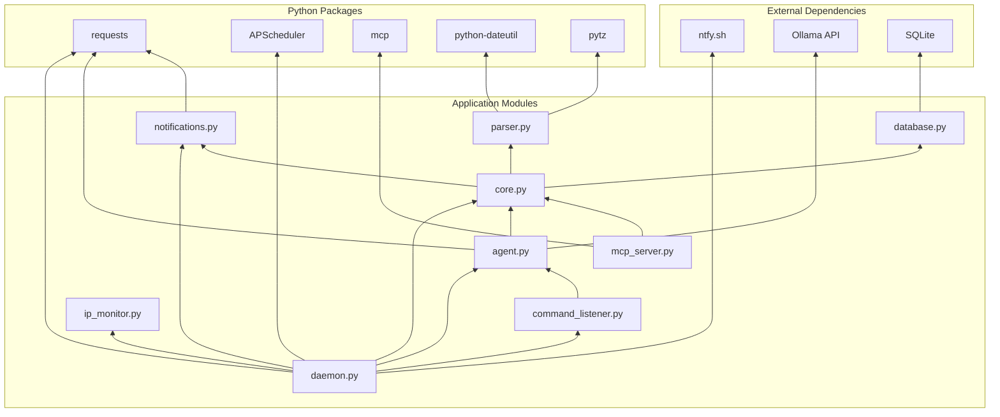

# Schedule Manager Architecture

## System Overview

```mermaid
flowchart TB
    subgraph User["👤 User Interfaces"]
        Siri["🎤 Siri / Apple Watch"]
        Phone["📱 iPhone ntfy App"]
        CLI["💻 Command Line"]
        OpenCodeUI["🖥️ OpenCode IDE"]
    end

    subgraph External["☁️ External Services"]
        ntfy["ntfy.sh Server"]
        Ollama["🦙 Ollama Server<br/>(192.168.1.250:11434)"]
    end

    subgraph Daemon["🔄 Schedule Manager Daemon"]
        direction TB
        Scheduler["⏰ APScheduler<br/>(Job Scheduler)"]
        CommandListener["👂 Command Listener<br/>(ntfy subscription)"]
        NotificationSender["📤 Notification Sender"]
        IPMonitor["🌐 IP Monitor"]
        RecurringGen["🔁 Recurring Task Generator"]
    end

    subgraph Agent["🤖 AI Agent Layer"]
        ScheduleAgent["Schedule Agent<br/>(agent.py)"]
        OpenCodeServer["OpenCode Server<br/>(port 5555)"]
        SystemPrompt["System Prompt<br/>(tool instructions)"]
    end

    subgraph MCP["🔌 MCP Integration"]
        MCPServer["MCP Server<br/>(mcp_server.py)"]
        MCPTools["MCP Tools:<br/>• schedule_add<br/>• schedule_view<br/>• schedule_update<br/>• schedule_delete<br/>• schedule_complete<br/>• schedule_reschedule<br/>• schedule_summary<br/>• schedule_upcoming<br/>• schedule_add_recurring"]
    end

    subgraph Core["⚙️ Core Components"]
        ScheduleManager["Schedule Manager<br/>(core.py)"]
        NLParser["Natural Language Parser<br/>(parser.py)"]
        Database["📊 SQLite Database<br/>(data/schedule.db)"]
        Config["⚙️ Config<br/>(config.yaml)"]
    end

    subgraph Data["💾 Database Tables"]
        Tasks["tasks<br/>• id, title, scheduled_time<br/>• priority, status, tags<br/>• is_recurring, recurrence_rule"]
        Notifications["notifications<br/>• id, task_id<br/>• notification_time<br/>• sent, notification_type"]
        IPHistory["ip_history<br/>• ip_address<br/>• detected_at"]
    end

    %% User Input Flows
    Siri -->|"Voice Command"| Phone
    Phone -->|"iOS Shortcut<br/>HTTP POST"| ntfy
    CLI -->|"Direct API"| ScheduleManager
    OpenCodeUI -->|"MCP Protocol"| MCPServer

    %% ntfy Communication
    ntfy -->|"SSE Stream<br/>(commands topic)"| CommandListener
    NotificationSender -->|"HTTP POST<br/>(notifications topic)"| ntfy
    ntfy -->|"Push Notification"| Phone

    %% Daemon Internal Flow
    CommandListener -->|"Raw Command"| ScheduleAgent
    ScheduleAgent -->|"HTTP API"| OpenCodeServer
    OpenCodeServer -->|"AI Request"| Ollama
    Ollama -->|"AI Response"| OpenCodeServer
    OpenCodeServer -->|"Tool Calls"| MCPServer

    %% MCP Flow
    MCPServer --> MCPTools
    MCPTools --> ScheduleManager

    %% Core Processing
    ScheduleManager --> NLParser
    ScheduleManager --> Database
    Database --> Tasks
    Database --> Notifications
    Database --> IPHistory

    %% Scheduler Jobs
    Scheduler -->|"Every 1 min"| NotificationSender
    Scheduler -->|"Every 5 min"| IPMonitor
    Scheduler -->|"Daily midnight"| RecurringGen
    Scheduler -->|"Daily 7am"| NotificationSender

    %% Notification Flow
    NotificationSender -->|"Query pending"| Database
    IPMonitor -->|"Log changes"| Database

    %% Config
    Config -.->|"Settings"| Daemon
    Config -.->|"Settings"| Agent
    Config -.->|"Settings"| Core

    %% Styling
    classDef userInterface fill:#e1f5fe,stroke:#01579b
    classDef external fill:#fff3e0,stroke:#e65100
    classDef daemon fill:#f3e5f5,stroke:#7b1fa2
    classDef agent fill:#e8f5e9,stroke:#2e7d32
    classDef mcp fill:#fce4ec,stroke:#c2185b
    classDef core fill:#fff8e1,stroke:#f57f17
    classDef data fill:#e0f2f1,stroke:#00695c

    class Siri,Phone,CLI,OpenCodeUI userInterface
    class ntfy,Ollama external
    class Scheduler,CommandListener,NotificationSender,IPMonitor,RecurringGen daemon
    class ScheduleAgent,OpenCodeServer,SystemPrompt agent
    class MCPServer,MCPTools mcp
    class ScheduleManager,NLParser,Database,Config core
    class Tasks,Notifications,IPHistory data
```



## Voice Command Flow (Detailed)

```mermaid
sequenceDiagram
    participant User as 👤 User
    participant Siri as 🎤 Siri
    participant Shortcut as 📱 iOS Shortcut
    participant ntfy as ☁️ ntfy.sh
    participant Listener as 👂 Command Listener
    participant Agent as 🤖 Schedule Agent
    participant OpenCode as 🖥️ OpenCode Server
    participant Ollama as 🦙 Ollama
    participant MCP as 🔌 MCP Server
    participant Core as ⚙️ Schedule Manager
    participant DB as 💾 SQLite

    User->>Siri: "Add meeting tomorrow at 3pm"
    Siri->>Shortcut: Transcribed text
    Shortcut->>ntfy: POST /nick_cmd_a1ask10h<br/>{"message": "add: meeting tomorrow at 3pm"}
    ntfy-->>Listener: SSE Event (JSON)
    
    Note over Listener: Daemon receives command
    
    Listener->>Agent: process_command(message)
    Agent->>OpenCode: POST /session/{id}/message<br/>{parts, model, agent, system}
    OpenCode->>Ollama: AI inference request
    Ollama-->>OpenCode: Tool call decision
    
    Note over OpenCode: AI decides to call schedule_add
    
    OpenCode->>MCP: schedule_add(description)
    MCP->>Core: add_task_natural(description)
    Core->>Core: Parse natural language
    Core->>DB: INSERT INTO tasks
    Core->>DB: INSERT INTO notifications
    DB-->>Core: task_id, notification_id
    Core-->>MCP: {success: true, task: {...}}
    MCP-->>OpenCode: Tool result
    OpenCode-->>Agent: Response parts
    Agent-->>Listener: {success: true, result: "Added: meeting..."}
    
    Note over Listener: Send confirmation
    
    Listener->>ntfy: POST /nick_testing_12345<br/>{"message": "✓ Added: meeting tomorrow at 3pm"}
    ntfy-->>User: 📱 Push notification
```



## Notification Delivery Flow

```mermaid
sequenceDiagram
    participant Scheduler as ⏰ APScheduler
    participant Sender as 📤 Notification Sender
    participant DB as 💾 SQLite
    participant ntfy as ☁️ ntfy.sh
    participant Phone as 📱 iPhone

    loop Every 1 minute
        Scheduler->>Sender: check_pending_notifications()
        Sender->>DB: SELECT * FROM notifications<br/>WHERE sent=0 AND time <= NOW
        DB-->>Sender: Pending notifications
        
        alt Has pending notifications
            loop For each notification
                Sender->>DB: Get task details
                DB-->>Sender: Task title, priority, time
                Sender->>ntfy: POST /{topic}<br/>{title, message, priority}
                ntfy-->>Phone: Push notification
                Sender->>DB: UPDATE notifications SET sent=1
            end
        end
    end
```



## Priority-Based Notification System

```mermaid
flowchart LR
    subgraph Input["📝 Task Creation"]
        NewTask["New Task"]
        Priority{"Priority?"}
    end

    subgraph NotifGen["🔔 Notification Generation"]
        High["High Priority<br/>[15, 5, 0] minutes"]
        MedLow["Medium/Low Priority<br/>[0] minutes"]
    end

    subgraph Output["📱 Notifications Sent"]
        High3["3 Notifications:<br/>• 15 min before<br/>• 5 min before<br/>• At task time"]
        Single["1 Notification:<br/>• At task time"]
    end

    NewTask --> Priority
    Priority -->|"high"| High
    Priority -->|"medium/low"| MedLow
    High --> High3
    MedLow --> Single

    style High fill:#ffcdd2,stroke:#c62828
    style MedLow fill:#c8e6c9,stroke:#2e7d32
    style High3 fill:#ffcdd2,stroke:#c62828
    style Single fill:#c8e6c9,stroke:#2e7d32
```



## Component Dependencies



## File Structure

```
schedule-manager/
├── config.yaml                 # Main configuration
├── data/
│   └── schedule.db            # SQLite database
├── schedule_manager/
│   ├── __init__.py
│   ├── core.py                # ScheduleManager class
│   ├── daemon.py              # Background daemon
│   ├── agent.py               # AI agent integration
│   ├── mcp_server.py          # MCP server for OpenCode
│   ├── parser.py              # Natural language parsing
│   ├── database.py            # Database operations
│   ├── notifications.py       # ntfy.sh integration
│   ├── command_listener.py    # Voice command listener
│   ├── command_processor.py   # Simple command processor
│   ├── ip_monitor.py          # IP change detection
│   └── exceptions.py          # Custom exceptions
├── docs/
│   └── architecture.md        # This file
└── tests/
    └── ...
```

## Configuration Reference

```yaml
# config.yaml structure
ntfy:
  server: "https://ntfy.sh"
  topic: "your_notification_topic"      # Outbound notifications
  commands_topic: "your_commands_topic" # Inbound voice commands
  commands_enabled: true

notifications:
  daily_summary_time: "07:00"
  reminder_minutes_before: [0]              # Default: single notification
  reminder_minutes_before_high_priority: [15, 5, 0]  # High priority: 3 notifications

schedule:
  timezone: "America/Chicago"

database:
  path: "data/schedule.db"

agent:
  enabled: true
  port: 5555
  model: "ollama/gpt-oss:20b-128k"    # Must support tool calling
  agent_name: "general"
  command_timeout_seconds: 90          # AI processing timeout
```

## Key Integrations

| Component | Purpose | Connection |
|-----------|---------|------------|
| **ntfy.sh** | Push notifications & voice commands | HTTPS REST API + SSE |
| **Ollama** | AI inference for natural language | HTTP API (port 11434) |
| **OpenCode** | MCP server host & AI orchestration | HTTP API (port 5555) |
| **SQLite** | Persistent storage | Local file |
| **iOS Shortcuts** | Siri integration | ntfy.sh HTTP POST |

## Scheduled Jobs

| Job | Frequency | Purpose |
|-----|-----------|---------|
| Check notifications | Every 1 minute | Send pending reminders |
| Check IP address | Every 5 minutes | Detect network changes |
| Daily summary | Daily at 7:00 AM | Morning schedule overview |
| Upcoming summary | Every 2 hours (work hours) | Preview next tasks |
| Generate recurring | Daily at midnight | Create tomorrow's recurring tasks |
